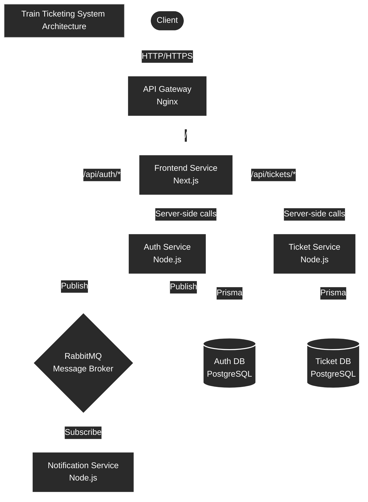

### BUET HACKATHON

```mermaid
%%{init: {
  'theme': 'dark',
  'themeVariables': {
    'fontFamily': 'arial',
    'fontSize': '16px',
    'primaryTextColor': '#fff',
    'primaryBorderColor': '#fff',
    'edgeLabelBackground': '#2a2a2a',
    'lineColor': '#fff',
    'textColor': '#fff',
    'mainBkg': '#2a2a2a',
    'secondaryColor': '#2a2a2a',
    'tertiaryColor': '#2a2a2a'
  }
}}%%

graph TD
    Client([Client])
    
    %% API Gateway
    Nginx[API Gateway<br/>Nginx]
    
    %% Frontend
    Frontend[Frontend Service<br/>Next.js]
    
    %% Backend Services
    Auth[Auth Service<br/>Node.js]
    Ticket[Ticket Service<br/>Node.js]
    Notify[Notification Service<br/>Node.js]
    
    %% Message Broker
    RabbitMQ{RabbitMQ<br/>Message Broker}
    
    %% Databases
    AuthDB[(Auth DB<br/>PostgreSQL)]
    TicketDB[(Ticket DB<br/>PostgreSQL)]
    
    %% Client to Gateway connections
    Client -->|HTTP/HTTPS| Nginx
    
    %% Gateway to Services
    Nginx -->|/| Frontend
    Nginx -->|/api/auth/*| Auth
    Nginx -->|/api/tickets/*| Ticket
    
    %% Service to Database connections
    Auth -->|Prisma| AuthDB
    Ticket -->|Prisma| TicketDB
    
    %% Message Broker connections
    Auth -.->|Publish| RabbitMQ
    Ticket -.->|Publish| RabbitMQ
    RabbitMQ -.->|Subscribe| Notify
    
    %% Internal Service communication
    Frontend -->|Server-side calls| Auth
    Frontend -->|Server-side calls| Ticket
    
    %% Styling with dark theme
    classDef gateway fill:#2a2a2a,stroke:#fff,stroke-width:2px,color:#fff
    classDef service fill:#2a2a2a,stroke:#fff,stroke-width:2px,color:#fff
    classDef database fill:#2a2a2a,stroke:#fff,stroke-width:2px,color:#fff
    classDef messagebroker fill:#2a2a2a,stroke:#fff,stroke-width:2px,color:#fff
    classDef client fill:#2a2a2a,stroke:#fff,stroke-width:2px,color:#fff
    
    class Nginx gateway
    class Auth,Ticket,Notify,Frontend service
    class AuthDB,TicketDB database
    class RabbitMQ messagebroker
    class Client client

    %% Add a title
    subgraph Train Ticketing System Architecture
    end

style Client color:#fff
style Nginx color:#fff
style Frontend color:#fff
style Auth color:#fff
style Ticket color:#fff
style Notify color:#fff
style RabbitMQ color:#fff
style AuthDB color:#fff
style TicketDB color:#fff
```
