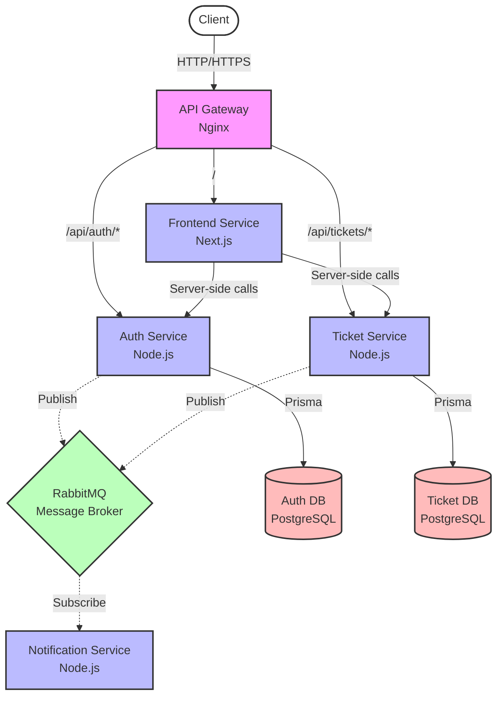

### BUET HACKATHON

```mermaid
graph TD
    Client([Client])

    %% API Gateway
    Nginx[API Gateway<br/>Nginx]

    %% Frontend
    Frontend[Frontend Service<br/>Next.js]

    %% Backend Services
    Auth[Auth Service<br/>Node.js]
    Ticket[Ticket Service<br/>Node.js]
    Notify[Notification Service<br/>Node.js]

    %% Message Broker
    RabbitMQ{RabbitMQ<br/>Message Broker}

    %% Databases
    AuthDB[(Auth DB<br/>PostgreSQL)]
    TicketDB[(Ticket DB<br/>PostgreSQL)]

    %% Client to Gateway connections
    Client -->|HTTP/HTTPS| Nginx

    %% Gateway to Services
    Nginx -->|/| Frontend
    Nginx -->|/api/auth/*| Auth
    Nginx -->|/api/tickets/*| Ticket

    %% Service to Database connections
    Auth -->|Prisma| AuthDB
    Ticket -->|Prisma| TicketDB

    %% Message Broker connections
    Auth -.->|Publish| RabbitMQ
    Ticket -.->|Publish| RabbitMQ
    RabbitMQ -.->|Subscribe| Notify

    %% Internal Service communication
    Frontend -->|Server-side calls| Auth
    Frontend -->|Server-side calls| Ticket

    %% Styling
    classDef gateway fill:#f9f,stroke:#333,stroke-width:2px
    classDef service fill:#bbf,stroke:#333,stroke-width:2px
    classDef database fill:#fbb,stroke:#333,stroke-width:2px
    classDef messagebroker fill:#bfb,stroke:#333,stroke-width:2px
    classDef client fill:#fff,stroke:#333,stroke-width:2px

    class Nginx gateway
    class Auth,Ticket,Notify,Frontend service
    class AuthDB,TicketDB database
    class RabbitMQ messagebroker
    class Client client
```
